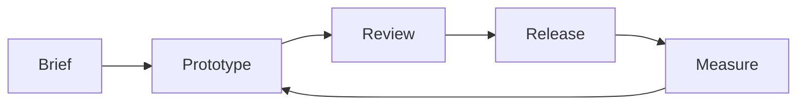

import {useState} from 'react'

export interface GraphNode {
  id: string
  label: string
  detail: string
  x: number
  y: number
}

export const graphNodes: GraphNode[] = [
  {id: 'brief', label: 'Brief', detail: 'Agree on the problem, audience, and constraints.', x: 90, y: 90},
  {id: 'prototype', label: 'Prototype', detail: 'Build the smallest version that can answer the risky questions.', x: 280, y: 90},
  {id: 'review', label: 'Review', detail: 'Put the prototype in front of users and record what changes.', x: 470, y: 90},
  {id: 'release', label: 'Release', detail: 'Ship the validated work with a rollback path and clear ownership.', x: 660, y: 90},
  {id: 'measure', label: 'Measure', detail: 'Compare the result with the original success criteria.', x: 470, y: 220},
]

export function ProjectGraph() {
  const [selected, setSelected] = useState('prototype')
  const active = graphNodes.find((node) => node.id === selected) ?? graphNodes[0]
  const edges = [
    ['brief', 'prototype'],
    ['prototype', 'review'],
    ['review', 'release'],
    ['release', 'measure'],
    ['measure', 'prototype'],
  ]
  const byId = Object.fromEntries(graphNodes.map((node) => [node.id, node]))
  return (
    <figure style={{margin: '2rem 0'}}>
      <svg viewBox="0 0 750 290" role="img" aria-label="Interactive project delivery graph" style={{display: 'block', width: '100%', maxWidth: 750, border: '1px solid #aaa', background: '#fafafa'}}>
        <defs>
          <marker id="arrow" viewBox="0 0 10 10" refX="9" refY="5" markerWidth="6" markerHeight="6" orient="auto-start-reverse">
            <path d="M 0 0 L 10 5 L 0 10 z" fill="#777" />
          </marker>
        </defs>
        {edges.map(([sourceId, targetId]) => {
          const source = byId[sourceId] as GraphNode
          const target = byId[targetId] as GraphNode
          return <line key={`${sourceId}-${targetId}`} x1={source.x} y1={source.y} x2={target.x} y2={target.y} stroke="#777" strokeWidth="2" markerEnd="url(#arrow)" />
        })}
        {graphNodes.map((node) => {
          const isSelected = node.id === selected
          return (
            <g key={node.id} transform={`translate(${node.x} ${node.y})`} role="button" tabIndex={0} aria-label={`Select ${node.label}`} onClick={() => setSelected(node.id)} onKeyDown={(event) => {
              if (event.key === 'Enter' || event.key === ' ') setSelected(node.id)
            }} style={{cursor: 'pointer', outline: 'none'}}>
              <rect x="-65" y="-25" width="130" height="50" rx="4" fill={isSelected ? '#222' : 'white'} stroke="#222" strokeWidth={isSelected ? 3 : 1} />
              <text textAnchor="middle" dominantBaseline="middle" fill={isSelected ? 'white' : '#222'} style={{font: '15px system-ui, sans-serif', pointerEvents: 'none'}}>{node.label}</text>
            </g>
          )
        })}
      </svg>
      <figcaption style={{maxWidth: 750, padding: '1rem', border: '1px solid #aaa', borderTop: 0}}>
        <strong>{active?.label}</strong>: {active?.detail}
      </figcaption>
    </figure>
  )
}

# A small project graph

This is an ordinary Markdown document with one interactive component and one Mermaid diagram. Everything needed to build it lives in this file.

> Prefer Markdown for document structure. Reach for a component only when interaction or custom rendering adds something Markdown cannot express.

## Delivery loop

Select a node to inspect that stage of the project.

<ProjectGraph />

### The same loop in Mermaid

## Current status

| Stage | Owner | State |
| --- | --- | --- |
| Brief | Product | Complete |
| Prototype | Engineering | In progress |
| Review | Research | Scheduled |
| Release | Operations | Waiting |

The release checklist is intentionally unremarkable:

- [x] Define success criteria
- [x] Build the first prototype
- [ ] Complete user review
- [ ] Prepare the release notes

## Why this example exists

The heading, prose, quotation, table, checklist, and Mermaid fence above are all Markdown. React is used directly only for the selectable graph and its detail readout. The presentation otherwise uses browser defaults, so the authored document remains easy to read and edit without specialized tooling.
